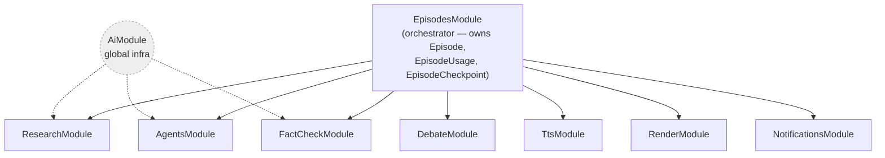
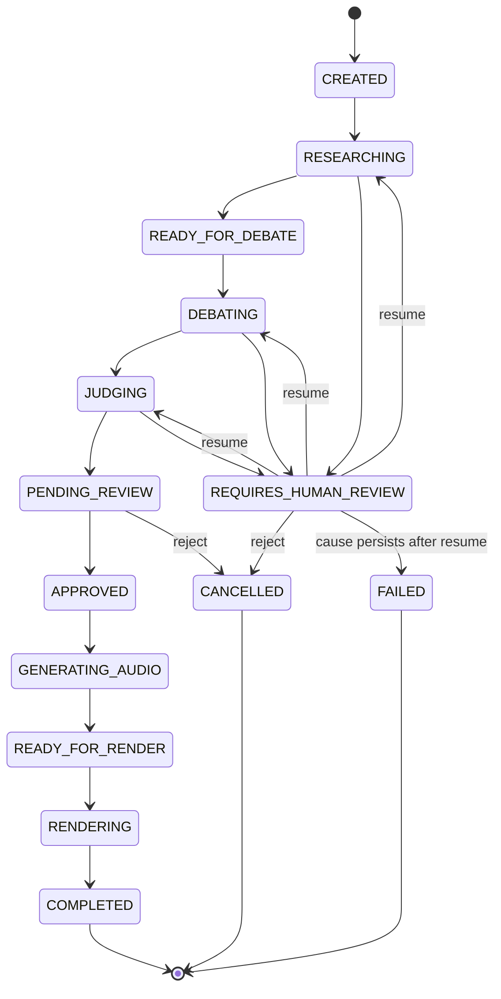

# AI Trend Debates — Backend

Backend for an automated pipeline that turns a trending topic into a short, fact-checked debate video between AI agents.

## What this is

Given a topic, the system researches it with real web sources, has two AI "debater" personas argue opposing views across structured rounds (opening, rebuttal, cross-examination), fact-checks every factual claim against the collected evidence before it's allowed into the debate, has a third AI act as judge, and synthesizes the final script into spoken audio. A human curator reviews and approves the result before it's handed off for video rendering.

The project is built around three constraints that shape most of the architecture:

- **Verifiability** — every factual claim in a debate must trace back to a source in an evidence base gathered before the debate starts. Claims that fail fact-checking go through an amendment loop with the agent instead of being silently allowed through.
- **Cost control** — every episode runs under a hard budget (LLM calls, search queries, TTS segments). Hitting a limit freezes the pipeline into a recoverable review state instead of failing silently or spending without bound.
- **Human-in-the-loop** — the pipeline is designed to pause and hand control to a human curator whenever something needs judgment: insufficient evidence, budget exceeded, a claim that keeps failing review, or the final episode before it ships. Nothing renders without explicit approval.

`Episode.status` is the single source of truth for where a given run is in this lifecycle — see `features.md` for the full state machine.

## Engineering highlights

Things in this codebase that go beyond wiring an LLM to an API endpoint:

- **Recoverable state machine, not just a status enum.** Failures are split into recoverable (`REQUIRES_HUMAN_REVIEW`, with a persisted `Checkpoint` — `fromState`, reason, and a snapshot of usage/round) and terminal (`FAILED`). A curator can resume an episode from exactly where it froze; the same resume path also doubles as crash recovery after a process restart, with no separate code path for either case.
- **Two layers of resilience, deliberately not merged into one.** Cockatiel gives each external integration its own reactive retry/circuit-breaker. A separate proactive gate (`LlmRateLimiterService`) tracks RPM/RPD per `ModelProvider` against free-tier quotas shared across modules, persisted in `LlmRequestLog` so it survives restarts — it sits *inside* each Cockatiel-wrapped call so internal retries respect the rate limit instead of quietly bypassing it.
- **Enforced module boundaries.** `EpisodesModule` is the only module that knows the full pipeline; the six domain modules (research, agents, debate, fact-check, tts, render) never import each other — dependencies only point downward. That's what makes it possible to unit-test fact-checking or TTS without booting the orchestrator.
- **Validated contracts at every boundary**, not just at the HTTP edge: LLM structured output is Zod-validated before it's trusted (`shared/contracts/`), kept as a separate schema layer from HTTP DTOs even where the shapes coincide, because they change for different reasons.
- **A real fact-checking loop, not a rubber stamp.** Claims are classified (factual vs. opinion/prediction) and routed differently; a failing claim triggers a bounded amendment loop with the originating agent (max 3 attempts) before escalating to a human — no infinite retries, no silent pass-through.
- **Multi-provider LLM abstraction** (Vercel AI SDK) across 5 providers behind one `ModelProviderFactory`, including a free-tier OpenRouter path whose models were validated by hand against the live API rather than assumed from docs.

The reasoning behind each of these — what was tried, what was ruled out, and what evidence settled it — is written up as it happened in `decision-log.md`.

## Architecture at a glance

`EpisodesModule` is the only module that knows the full pipeline. The six domain modules never import each other — dependencies only point downward (`architecture.md` §3):



`Episode.status` is the single state machine in the system (`features.md` Feature 4). `REQUIRES_HUMAN_REVIEW` is a recoverable, transversal state — reachable from any active phase — that resumes back into the exact phase it froze from once a curator resolves the cause, and only escalates to the terminal `FAILED` if the same cause happens again after a resume:



## Testing

- **Unit tests** (Jest) per module, with the LLM and search provider mocked — fast, deterministic, no network.
- **End-to-end tests** boot the full `AppModule` against an isolated test database.
- **Smoke scripts** (`npm run smoke:*`) run the real pipeline against live Gemini/Tavily APIs. They're intentionally not part of the automated suite — they cost real API credits — and they're what actually caught the non-obvious bugs (a claim evaluated without its surrounding argument context, a rate limiter undercounting a shared-quota provider) documented in `decision-log.md`.

## Status

The P0 scope (research → debate → fact-checking → judging → human review, end-to-end, with live SSE updates) is implemented and has been run against real Gemini/Tavily/TTS traffic — see `roadmap.md` for the current next step and `tasks.md` for module-by-module state. Video rendering (P1) is designed (`features.md` Feature 9) but not yet implemented.

## Stack

- **NestJS 11** — API framework and module/dependency-injection backbone for the orchestration pipeline.
- **Prisma 7** — persistence (SQLite locally).
- **Vercel AI SDK** — multi-provider LLM abstraction with Zod-validated structured output; supports Google, OpenAI, Anthropic, xAI, and OpenRouter (free-tier models) as interchangeable `ModelProvider`s.
- **Zod 4** — contracts for agent I/O and HTTP DTOs.
- **Cockatiel** — retry / circuit-breaker around every external integration.
- **Tavily** — web search provider for the research stage.
- **echogarden + Piper** — local, free text-to-speech (Google TTS and OpenRouter audio providers are supported by the same abstraction, pluggable via `TTS_PROVIDER`).

See `architecture.md` for the full module map, dependency rules, and the orchestration algorithm.

## Quick start

```bash
npm install
npx prisma generate && npx prisma migrate deploy && npm run db:seed
cp .env.example .env   # then set GOOGLE_API_KEY and TAVILY_API_KEY (both free tier)
npm run start:dev
```

Full setup checklist, every env var explained, and how to run tests/smoke scripts: **`setup.md`**.

## Project documentation

This repo is documentation-heavy on purpose: the pipeline has non-obvious state machine and recovery behavior that's easier to get wrong than to write down once.

| Doc | Contents |
|---|---|
| `features.md` | Product spec: objectives, acceptance criteria, and the full `Episode` state machine per feature |
| `architecture.md` | Module map, dependency direction, orchestration algorithm, resilience patterns |
| `api-contract.md` | HTTP surface: endpoints, SSE events, error format, valid state transitions |
| `setup.md` | Full local setup checklist, env vars, and manual validation scripts |
| `coding-rules.md` | Conventions to follow when implementing a piece of the pipeline |
| `decision-log.md` | Why non-obvious decisions were made — what was considered, what was ruled out, what evidence settled it |
| `roadmap.md` / `tasks.md` | Delivery priority and module-by-module implementation status |

## Author

Leonardo Magariños — [GitHub](https://github.com/leomgs) · [LinkedIn](https://linkedin.com/in/leomgs)

## License

MIT — see `LICENSE`.
